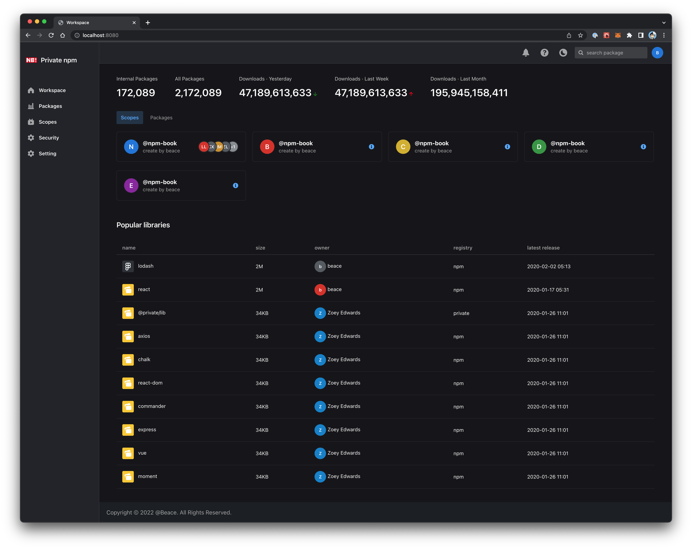
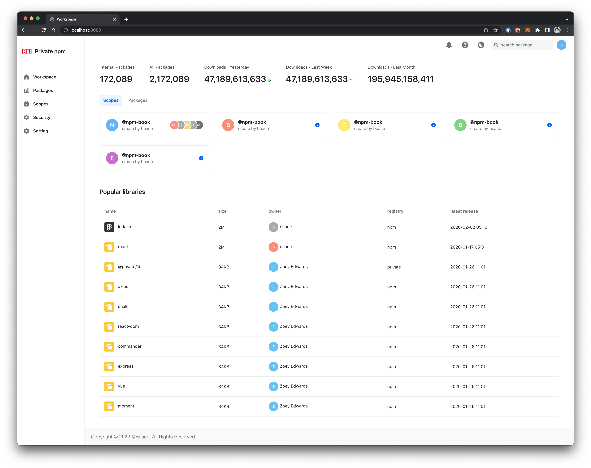

# [WIP] private npm website

A private npm registry manager client, still work in progress.



## Features

- Enterprise private account system, such as support for SSO authentication
- More fine-grained npm package data reporting
- Private scope application, registration and management, scope personnel management
- Package preview (public, private), vulnerability report
- Security module, including bug-versions management and internal advisories management

## Preview



## Tech Stacks

1. [Node.js LTS](https://github.com/nodejs/Release)
    * [Automatically call nvm use](https://github.com/nvm-sh/nvm#deeper-shell-integration)
2. [Modern.js](https://modernjs.dev/)
3. [Semi-UI](https://github.com/DouyinFE/semi-design)

## How to develop

```
$ npm run dev
```

using more features

```
npm run new
```

others

```
npm run build        # 按产品环境的要求，构建项目
npm run start        # 按产品环境的要求，运行项目
```
